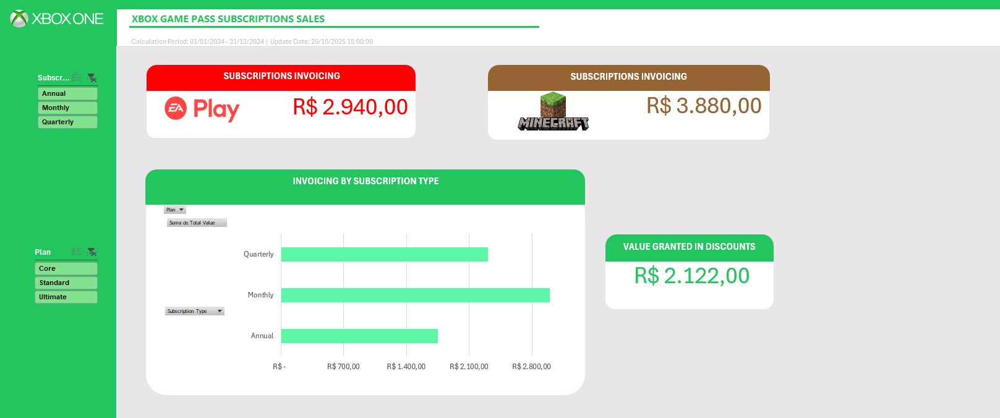
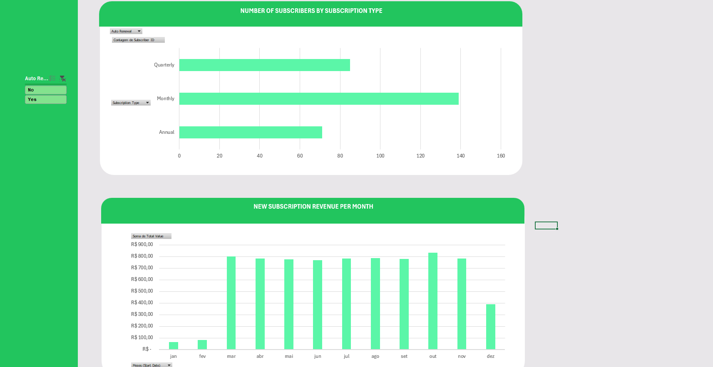

# Dashboard de Análise de Assinaturas Xbox 

Este projeto é um dashboard desenvolvido em Microsoft Excel com o objetivo de transformar uma base de dados de vendas de assinaturas em informações visuais e insights.

A partir de uma tabela de dados tratada, foram utilizadas tabelas dinâmicas para modelar os dados e gráficos dinâmicos para compor o painel visual, permitindo uma análise clara do faturamento, descontos e comportamento dos assinantes.

## Preview do Dashboard

Aqui estão as principais telas do painel finalizado:

---

## Principais Análises e KPIs

O dashboard permite a exploração dos dados através de filtros (Segmentação de Dados) e responde às seguintes perguntas:

### KPIs Principais
* Faturamento Total por Add-on: Separação clara da receita vinda de EA Play (R$ 2.940,00) e Minecraft Season Pass (R$ 3.880,00).
* Valor Total em Descontos: Monitoramento do total concedido em cupons R$ 2.122,00.

### Gráficos e Insights
1.  Faturamento por Tipo de Assinatura:
    * Visualiza qual ciclo de pagamento (mensal, trimestral, anual) gera mais receita total.

2.  Novas Receitas por Mês:
    * Gráfico que monitora a aquisição de nova receita (baseado na Start Date), mostrando picos ao longo do ano.

3.  Análise de Assinantes por Ciclo:
    * Contagem de quantos assinantes existem em cada ciclo de pagamento.
    * Combinado com o filtro de Auto-Renewal, este gráfico se torna uma poderosa ferramenta de análise de risco, mostrando quantos assinantes (e de qual ciclo) estão com a renovação automática desligada.

---

## Ferramentas e Metodologia

* Ferramenta: Microsoft Excel
* Modelagem: Os dados foram analisados usando tabelas dinâmicas (Pivot Tables), que estão centralizadas na planilha "Cálculos".
* Visualização: Foram usados gráficos dinâmicos (Pivot Charts) e segmentação de dados (Slicers) para criar a interatividade do painel.

---

## Estrutura do Arquivo

O repositório contém o arquivo principal do projeto (.xlsx). Para garantir uma experiência de usuário limpa e profissional, apenas a aba "Dashboard" está visível.

As planilhas de suporte estão ocultas, mas contidas no mesmo arquivo:

* Aba "Dashboard": A única planilha visível, contendo a interface principal do painel.
* Aba "Cálculos" (Oculta): Planilha "back-end" que contém todas as tabelas dinâmicas que alimentam os gráficos.
* Aba "Base de Dados" (Oculta): Tabela original tratada que serve como fonte para todo o projeto.

(Para inspecionar as planilhas de back-end, basta abrir o arquivo no Excel, clicar com o botão direito na aba "Dashboard" e selecionar "Reexibir".)